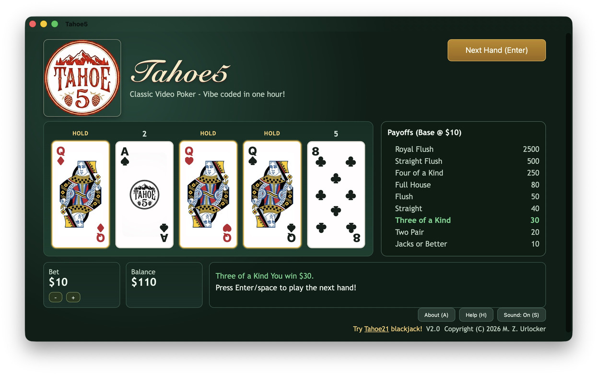

# Tahoe 5

Tahoe 5 is a browser-based video poker game inspired by the original Turbo Pascal shareware version published in 1992.



## Play It

**In a browser** — [zurlocker1.github.io/Tahoe5](https://zurlocker1.github.io/Tahoe5/). Nothing to
install, and it works on desktop and mobile.

**On a Mac** — [download Tahoe5.dmg](https://github.com/ZUrlocker1/Tahoe5/releases/latest/download/Tahoe5.dmg).
A native Mac app: the same game running in a WebKit view, so it gets a real window, a Dock icon, and
works offline. Requires macOS 14 or later. Signed and notarized, so it opens without Gatekeeper
complaining. Source is in [`mac/`](mac/).

**On iPhone and iPad** — a native version was built and works, but it is not distributed. Apple does
not allow individual developers to publish apps whose rating declares simulated gambling; that
requires enrolling as an organization, which means forming a legal entity. Not worth it for a hobby
game, so the browser version is how to play on iOS.


## Project Background

This project was based on a Turbo Pascal shareware game I published in 1992. It was made available for DOS, Windows and the Atari Portfolio. Unfortunately, I lost the source code decades ago.

So last summer, I vibe coded a text mode version using Turbo Pascal 4.0 in a DOS Box with some ChatGPT assistance. I wrote most of the code (about 600 lines) by hand. ChatGPT generated an efficient shuffle algorithm as well as the music routines. The latter didn't compile and had to be corrected by hand.

Now with ChatGPT 5.3 and the CodeX app from OpenAI, I created a PRD from the working Turbo Pascal source code. Then I asked it to generate a VS Code project. It created the JavaScript app (around 700 lines) and the related html and css files (another 700 lines.) It compiled and ran first time! I added some graphics for the cards and then added a few features and fixed minor bugs using prompts in CodeX.

I did not write or review any code in this version. It just worked!

## What This Repo Contains

- A playable web video poker app in `/app`
- Product requirements document in `/docs/PRD-video-poker-web.md`
- The native Mac / iPhone / iPad app in [`/mac`](mac/) — an Xcode project that wraps the game in a
  WebKit view. See [`mac/README.md`](mac/README.md) for how it is built and released.

**`/app` and `/mac/Web` are two different versions of the game.** `/mac/Web` began as a copy of
`/app` and then diverged: About panel wording, a cross-promotion link, and a lot of responsive CSS
for iPad sizes and small Mac windows. This was a one-way conversion — the two are deliberately not
kept in sync, and neither is being updated. `/app` is what GitHub Pages serves; `/mac/Web` is what
ships inside the Mac app.

## Features

- Classic 5-card draw video poker loop
- Hold toggles by click/tap and keyboard (`1-5`)
- Keyboard controls for deal/draw (`Enter`), bet (`arrows`), help (`H`), info (`I`), sound (`S`)
- Audio cues for deal, hold, wins, losses, and special win tiers
- Custom card graphics including themed backs and face-card artwork
- Hidden Secret Test Mode (`Z` in result state) for rapid hand evaluation testing

## Run Locally

```bash
cd app
python3 -m http.server 8080
```

Open:

`http://localhost:8080`
